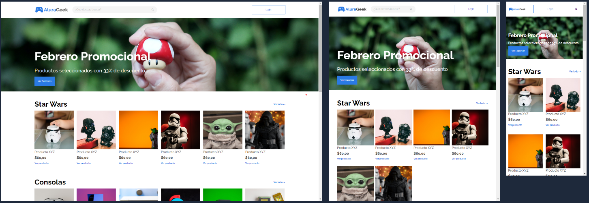

# Challenge ONE Front-End Sprint 02 - AluraGeek: Creando tu propio e-commerce.

## Construye un e-commerce
Desarrollo realizado para el reto "Challenge ONE Front-end Sprint 02", del programa ALURA + Oracle Next Education * Educación y empleabilidad *.

* En éste desafío desarrollarás un e-commerce! Para apoyarte en ésta tarea hemos dividido el desafio en dos sprint:

    Sprint 2: Te enfocarás en la estilización.
    Sprint 3: Desarrollarás las funcionalidades, usando javascript.

## Funcionalidades en javascript imlementadas
 * Login de usuario con sesion.
 * Generacion dinámica de los productos registrados en la API desde la vista "productos.html".

## Requerimientos para probar este desarrollo:
* Git.
* Visual Studio Code. (Con plugin live server instalado).
* Node JS (Dependencia: JSON server instalada)

## Configuración para prueba local del proyecto:
* Clonar proyecto
* Abrir proyecto en Visual Studio Code
* Abrir terminal e iniciar servidor Json-server comando:  json-server --watch db.json
* Seleccionar archivo index.html con clic derecho y abrirlo con Liver server (plugin para visualstudio code).

## Tecnologías Utilizadas:

* HTML5
* CSS3
* JavaScript
* Diseño Web Responsivo: Flex - Grid
* Metodología Bem

## Acerca del autor:
* [LinkedIn](https://www.linkedin.com/in/carlos-munera-259969262 "Linkedin")
